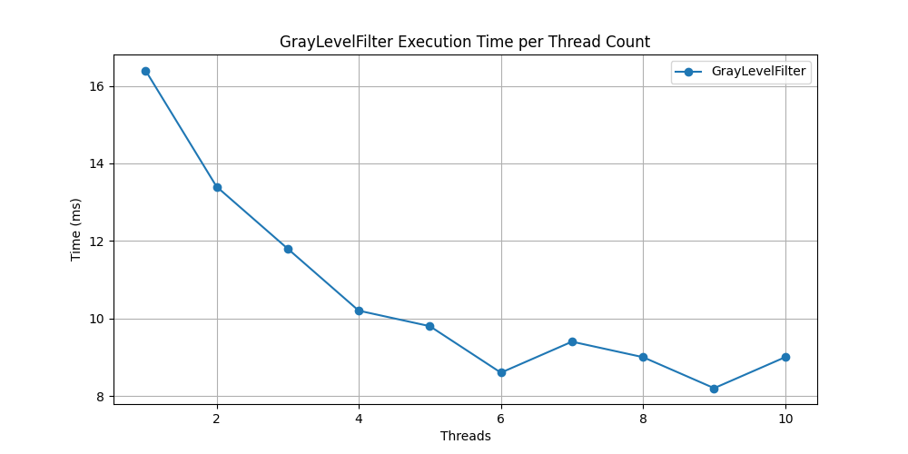
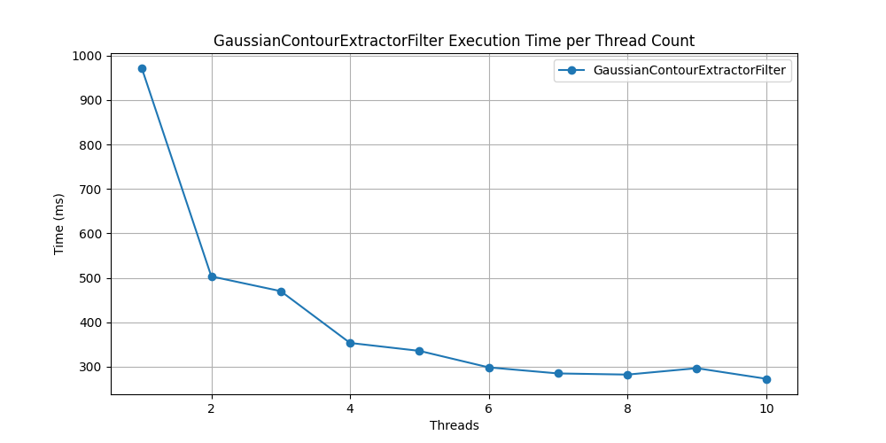
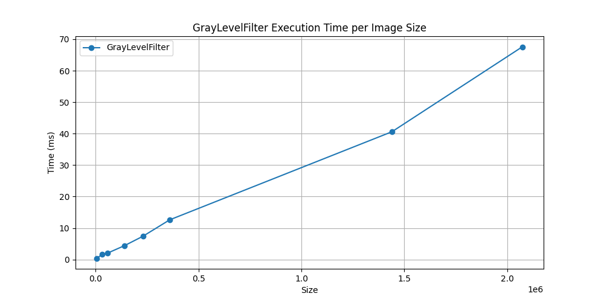
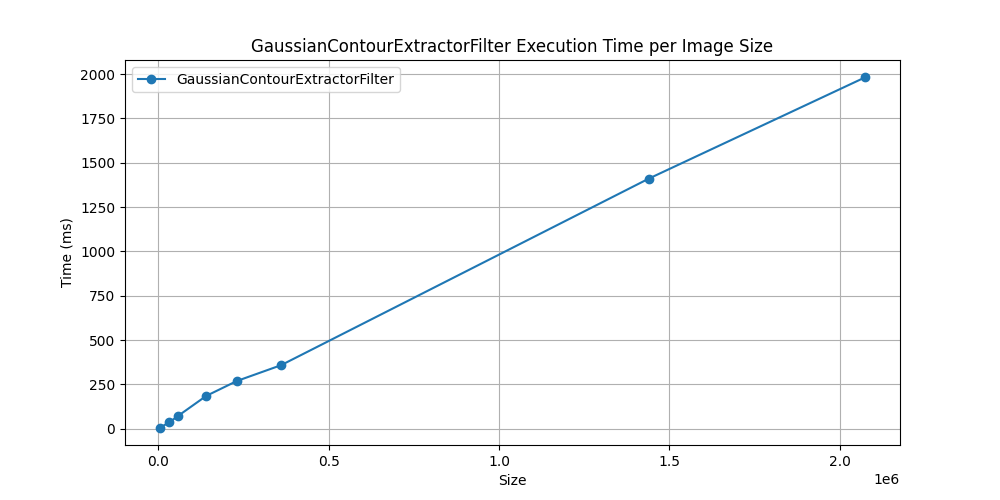

# SPP TP 3
### Fait par OUATTARA Daouda et DURAND Corentin

## Partie 1

Tout d’abord, nous avons créé les classes `GrayLevelFilter` et `GaussianContourExtractorFilter`, qui implémentent l’interface `IFilter`, afin de créer des filtres. Ces fichiers se trouvent dans `src\filter`.

Ensuite, nous avons créé la classe `SingleThreadedImageFilteringEngine` (dans `src`), qui implémente l’interface `IImageFilteringEngine` (dans `src\filter`), pour permettre l’application de filtres sur une image. L’application principale se trouve dans `src\App.java`.

Enfin, nous avons écrit des cas de test dans `test\FilterTests.java`. Ces tests vérifient le bon fonctionnement des classes qui implémentent les interfaces.

## Partie 2

Dans cette partie, nous avons créé la classe `MultiThreadedImageFilteringEngine` (dans `src`) afin de répartir l'application des filtres sur plusieurs threads, dans le but d'accélérer le traitement. Pour cela, nous avons utilisé des mécanismes de synchronisation, notamment `CyclicBarrier` pour synchroniser les threads entre eux, et `Thread.join()` pour permettre au thread principal d’attendre la fin de l’exécution des threads secondaires.

## Partie 3

Pour finir, nous avons analysé les performances de l’application des filtres en utilisant un ou plusieurs threads, et ce, sur des images de différentes tailles (dans `src\Analysis.java`). Les résultats sont illustrés par les graphes suivants (dans `src\analysis\chart.ipynb`):

### Graphe d'application du filtre Gray en utilisant 1 à 10 threads

### Graphe d'application du filtre Gaussian en utilisant 1 à 10 threads

En observant les deux graphes, on constate que le filtre de niveaux de gris (Gray) est plus rapide que le filtre gaussien (Gaussian). De plus, l’augmentation du nombre de threads réduit le temps d’exécution. Toutefois, la vitesse d’exécution dépend également des performances de la machine utilisée.

### Graphe d'application du filtre Gray sur des images de différentes tailles

### Graphe d'application du filtre Gaussian sur des images de différentes tailles

Sur ces graphes, on observe que plus l’image est grande, plus le temps d’exécution augmente. Le filtre de niveaux de gris est plus rapide que le filtre gaussien.